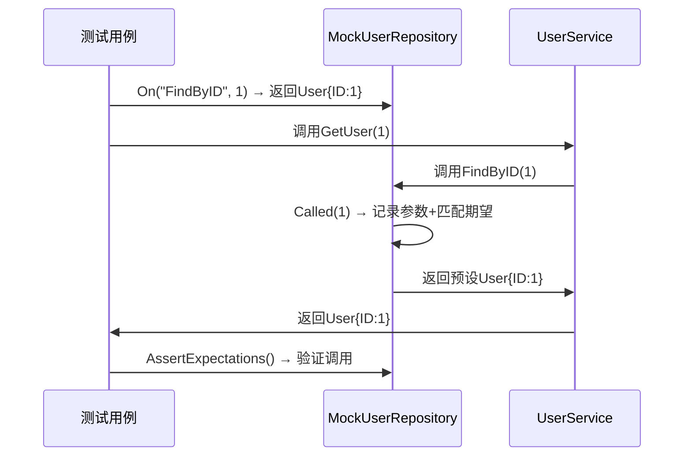

## 1 引言
在单元测试中，我们常需**隔离外部依赖**（如数据库、API），此时接口 Mock 是关键工具。Testify 的 `mock` 包通过**接口嵌入**和**方法拦截**机制，让开发者无需手动编写桩代码，即可快速生成 Mock 对象并验证调用行为。

## 2 Testify Mock 的核心机制
Testify Mock 的本质是**基于接口的动态代理**，核心流程可总结为：`设置期望 → 调用 Mock 方法 → 记录参数 → 返回预设结果 → 验证期望`。

### 2.1 接口嵌入：Mock 对象的“继承”魔法
Testify 要求 Mock 对象**嵌入 `mock.Mock` 结构体**，并实现目标接口的所有方法。嵌入 `mock.Mock` 后，Mock 对象自动获得 `On()`（设置期望）、`Called()`（记录调用）等核心方法。

**示例**：定义一个 Mock 实现 `UserRepository` 接口：
```go
// 目标接口
type UserRepository interface {
    FindByID(id int) (*User, error)
}

// Mock 对象（嵌入 mock.Mock）
type MockUserRepository struct {
    mock.Mock // 关键：嵌入 Mock 结构体
}

// 实现接口方法（必须与目标接口完全一致）
func (m *MockUserRepository) FindByID(id int) (*User, error) {
    args := m.Called(id) // 记录调用参数
    return args.Get(0).(*User), args.Error(1) // 返回预设结果
}
```

### 2.2 方法拦截：如何“接管”接口调用？
Testify 的方法拦截并非“黑盒魔法”，而是通过**显式调用 + 反射匹配**实现的，核心流程分为两步：

#### 1. 显式注入拦截点
Mock 对象的方法（如 `FindByID`）必须**主动调用 `m.Called(args...)`**——这是拦截的“入口”。例如，`MockUserRepository` 的 `FindByID` 方法实现如下：
```go
func (m *MockUserRepository) FindByID(id int) (*User, error) {
    args := m.Called(id) // 关键：显式将参数传入 Called()
    return args.Get(0).(*User), args.Error(1)
}
```
当业务代码调用 `mockRepo.FindByID(1)` 时，实际上是在执行这个 Mock 方法，而 `m.Called(id)` 会接管后续的参数记录和结果返回逻辑。

#### 2. 反射匹配期望
`Called()` 方法内部依赖**反射（reflect）**完成两件事：
- **参数记录**：通过反射获取传入的参数（如 `id=1`），并存储到 Mock 对象的内部调用列表中，用于后续的 `AssertExpectations()` 验证；
- **期望匹配**：遍历之前通过 `On()` 设置的期望（如 `On("FindByID", 1).Return(...)`），用反射比较**方法名**和**参数值**是否完全一致。若匹配成功，返回预设的结果；若未找到匹配的期望，抛出 `no matching expectation` 错误。

简言之，Testify 的拦截是“显式的”——依赖 Mock 方法主动调用 `Called()`，并通过反射实现期望的匹配。

### 2.3 期望管理：从“设置”到“验证”
- **设置期望**：通过 `On()` 定义“当调用某方法时，返回某结果”（如 `mockRepo.On("FindByID", 1).Return(&User{}, nil)`）；
- **验证期望**：通过 `AssertExpectations()` 检查“方法是否按预期被调用”（如参数是否匹配、调用次数是否正确）。

## 3 实现细节：反射与方法匹配
Testify Mock 底层依赖**反射（reflect）**实现方法匹配：
1. 当调用 `On(methodName string, args ...interface{})` 时，Testify 会记录**方法名**和**参数模板**（如 `FindByID` 和 `1`）；
2. 当 `Called(args ...interface{})` 被调用时，Testify 会通过反射**匹配方法名和参数**，找到对应的期望结果；
3. 若匹配成功，返回预设值；若失败，抛出“未找到期望”的错误。

## 4 Mock 工作流程可视化


## 5 为什么 Mock 能“替代”真实接口？
Testify Mock 的核心逻辑是**“接口适配”**：
- Mock 对象通过嵌入 `mock.Mock` 实现了目标接口的所有方法；
- 业务代码依赖的是**接口类型**，而非具体实现，因此 Mock 对象可无缝替代真实实现；
- 方法拦截机制让 Mock 能“接管”所有接口调用，返回预设结果并验证行为。

## 6 总结
Testify Mock 的实现原理可归纳为：
1. **接口嵌入**：通过 `mock.Mock` 获得核心能力；
2. **方法拦截**：`Called()` 记录参数并返回预设值；
3. **期望管理**：`On()` 设置期望，`AssertExpectations()` 验证调用。

这种机制让开发者无需关心底层细节，只需专注于测试逻辑，大幅提升了单元测试的效率。