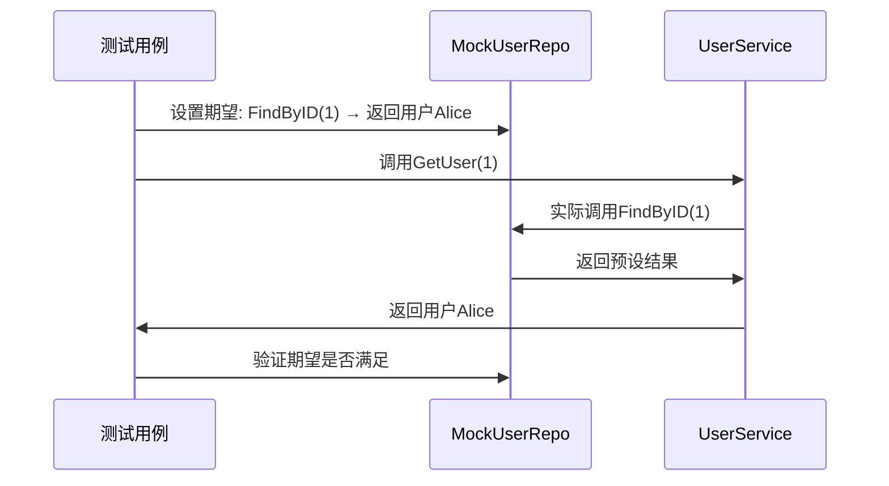

## 1 什么是Testify？
Testify是Go生态中最流行的**第三方测试框架**，专注于简化单元测试的编写流程。它基于标准库`testing`扩展，提供了**断言库**、**Mock工具**、**测试套件**三大核心能力，解决了标准库测试代码冗余、断言不直观的痛点。

---

## 2 Testify的核心特性
Testify的价值在于**用更简洁的语法实现更强大的测试逻辑**，核心特性分为三类：

### 2.1 断言库：告别手动if判断
Testify提供`assert`和`require`两个断言包，覆盖几乎所有常见场景（相等性、空值、错误、类型等）：
- **assert**：断言失败时**继续执行测试**（适合验证多个条件）；
- **require**：断言失败时**立即终止测试**（适合前置条件验证）。

**示例**：
```go
func TestCalculate(t *testing.T) {
    result := Calculate(10, 5)
    assert.Equal(t, 15, result, "加法结果错误")  // 失败继续
    require.NotNil(t, result, "结果不能为nil")   // 失败终止
}
```

---

### 2.2 Mock工具：快速模拟依赖
Testify的`mock`包支持**基于接口生成Mock对象**，无需手动编写桩代码。通过`On()`设置期望调用，`AssertExpectations()`验证调用是否符合预期。

**Mock工作流程**


---

### 2.3 测试套件：组织复杂测试
通过`suite`包可以将相关测试用例组织成**测试套件**，支持`Setup()`（前置初始化）、`TearDown()`（后置清理）等生命周期方法，减少重复代码。

**示例**：
```go
type UserServiceSuite struct {
    suite.Suite
    service *UserService
    mockRepo *MockUserRepository
}

// SetupTest 每个测试用例前执行
func (s *UserServiceSuite) SetupTest() {
    s.mockRepo = new(MockUserRepository)
    s.service = NewUserService(s.mockRepo)
}

// 测试用例
func (s *UserServiceSuite) TestGetUser_Success() {
    s.mockRepo.On("FindByID", 1).Return(&User{ID:1, Name:"Alice"}, nil)
    user, err := s.service.GetUser(1)
    s.NoError(err)
    s.Equal("Alice", user.Name)
}

// 运行套件
func TestUserServiceSuite(t *testing.T) {
    suite.Run(t, new(UserServiceSuite))
}
```

---

## 3 实现原理剖析
### 3.1 断言的底层逻辑
Testify的断言基于**反射（reflect）**实现：
1. 对断言的两个值进行类型检查；
2. 递归比较值的内部结构（如结构体的字段、切片的元素）；
3. 生成人类可读的错误信息（如“期望int(15)，实际得到int(10)”）。

### 3.2 Mock的实现机制
Testify的Mock通过**嵌入`mock.Mock`结构体**实现：
1. 生成的Mock对象会继承`mock.Mock`的`On()`、`Called()`等方法；
2. 当调用Mock的方法时，`Called()`会记录参数并返回预设结果；
3. `AssertExpectations()`通过反射验证所有期望的方法是否被正确调用。

---

## 4 与其他测试框架的对比
| 特性                | Testify          | 标准库`testing` | Ginkgo（BDD框架） |
|---------------------|------------------|------------------|-------------------|
| 断言简洁性          | 高（`assert.Equal`） | 低（手动if判断）  | 中（`Expect().To()`） |
| Mock支持            | 内置（无需额外工具） | 无               | 需配合Gomega       |
| 测试组织            | 支持套件          | 无               | 强（BDD分层）      |
| 学习成本            | 低（贴近标准库）  | 低               | 高（BDD语法）      |

---

## 5 适用场景与禁忌
### 5.1 适用场景
- **单元测试**：快速验证函数/方法的逻辑正确性；
- **集成测试**：模拟数据库/外部服务等依赖；
- **边界条件测试**：用断言快速覆盖异常场景（如空指针、非法参数）。

### 5.2 禁忌场景
- **性能测试**：Mock的反射操作会引入额外开销，影响性能数据准确性；
- **端到端测试**：Testify更适合单元级测试，端到端测试建议用`httptest`或`ginkgo`。

---

## 6 快速上手示例
以下是一个完整的Testify测试用例，覆盖**断言**、**Mock**、**套件**三大特性：

```go
package service_test

import (
	"testing"
	"github.com/stretchr/testify/assert"
	"github.com/stretchr/testify/mock"
	"github.com/stretchr/testify/suite"
)

// 1. 定义业务接口
type UserRepository interface {
	FindByID(id int) (*User, error)
}

type User struct {
	ID   int
	Name string
}

type UserService struct {
	repo UserRepository
}

func NewUserService(repo UserRepository) *UserService {
	return &UserService{repo: repo}
}

func (s *UserService) GetUser(id int) (*User, error) {
	return s.repo.FindByID(id)
}

// 2. 生成Mock对象
type MockUserRepository struct {
	mock.Mock
}

func (m *MockUserRepository) FindByID(id int) (*User, error) {
	args := m.Called(id)
	return args.Get(0).(*User), args.Error(1)
}

// 3. 定义测试套件
type UserServiceSuite struct {
	suite.Suite
	service *UserService
	mockRepo *MockUserRepository
}

func (s *UserServiceSuite) SetupTest() {
	s.mockRepo = new(MockUserRepository)
	s.service = NewUserService(s.mockRepo)
}

// 4. 编写测试用例
func (s *UserServiceSuite) TestGetUser_Success() {
	// 设置Mock期望
	s.mockRepo.On("FindByID", 1).Return(&User{ID: 1, Name: "Alice"}, nil)
	// 执行测试
	user, err := s.service.GetUser(1)
	// 断言结果
	assert.NoError(s.T(), err)
	assert.Equal(s.T(), "Alice", user.Name)
	// 验证Mock调用
	s.mockRepo.AssertExpectations(s.T())
}

func (s *UserServiceSuite) TestGetUser_NotFound() {
	s.mockRepo.On("FindByID", 2).Return(nil, errors.New("user not found"))
	user, err := s.service.GetUser(2)
	assert.Error(s.T(), err)
	assert.Nil(s.T(), user)
}

// 5. 运行测试
func TestUserServiceSuite(t *testing.T) {
	suite.Run(t, new(UserServiceSuite))
}
```

---

## 7 关键注意事项
- **断言选择**：优先用`require`处理前置条件（如“连接数据库失败”），用`assert`验证业务逻辑；
- **Mock清理**：每个测试用例后需调用`mock.AssertExpectations()`，避免遗漏未验证的期望；
- **版本兼容**：Testify v1.8+ 要求Go 1.18+，注意项目的Go版本依赖。